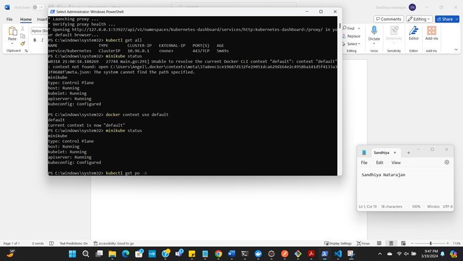
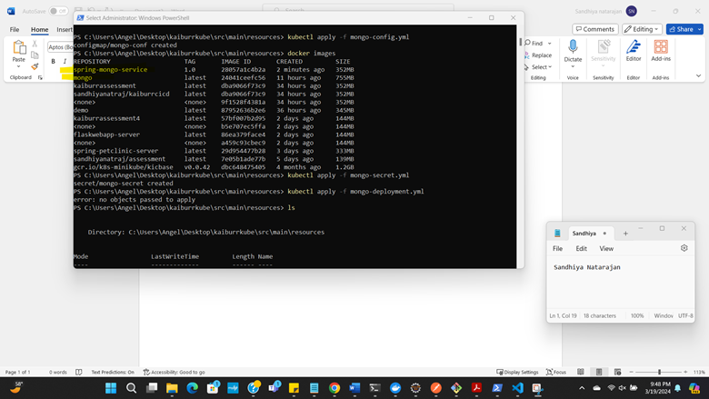
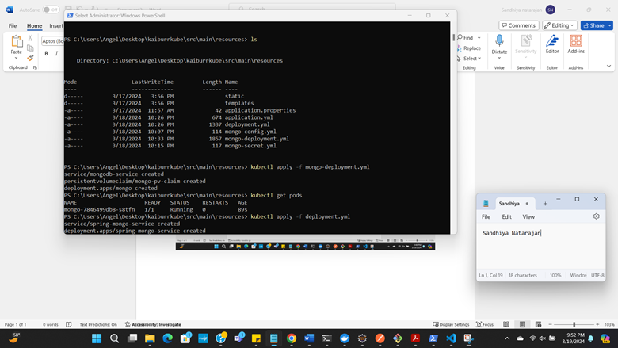
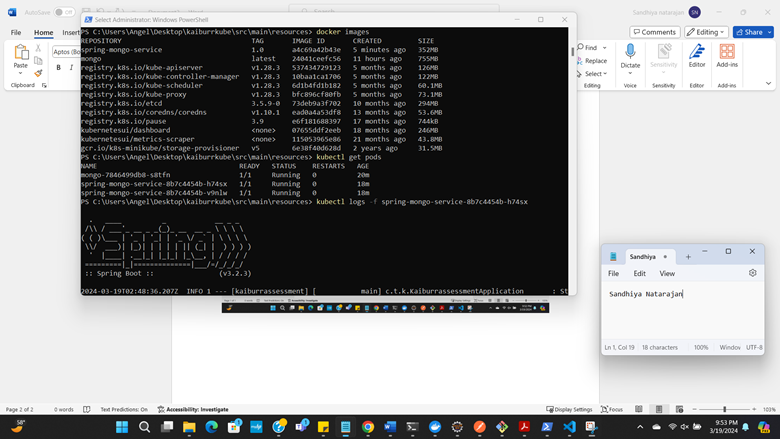
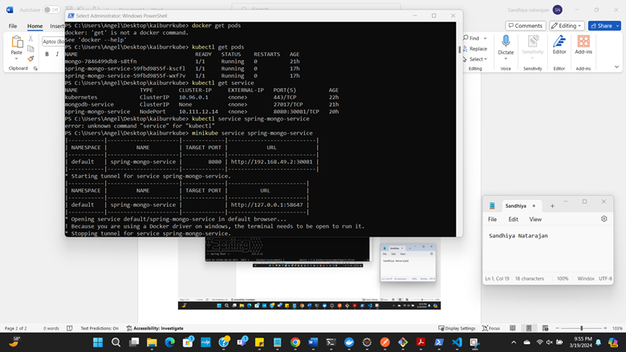
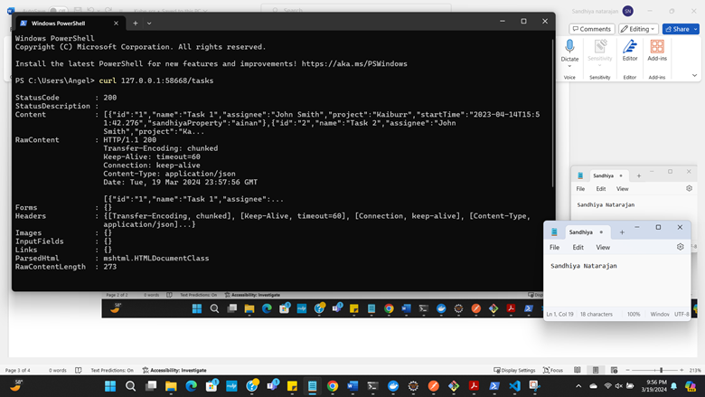

# Task 2: Kubernetes Deployment 

In this task, we'll deploy an application using Kubernetes. We'll follow these steps:

1. Create Dockerfiles and build Docker images for the application.
2. Create Kubernetes YAML manifests for deployment and service.
3. Deploy the application to a Kubernetes cluster
4. Configure the application to use MongoDB connection details from environment variables.
5. Use a persistent volume to store MongoDB data.

## Step 1: Dockerizing the Application

- Create Dockerfiles for the application components.
- Build Docker images using the Dockerfiles.

## Step 2: Creating Kubernetes Manifests

- Write a YAML manifest for the application with service, deployment and persistent volume for MongoDB data.
- Write a YAML manifest for the spring application performing CRUD operations with service and deployment.

## Step 3: Deploying to Kubernetes Cluster

- Install minikube into docker container 
- Start minikube and check the status
- Apply the Kubernetes manifests to deploy the application.

## Step 4: Application Configuration

- Application configuration is available in mongo-secret.yml and mongo-config.yml

 **Screenshots:**

 

 

 

 

 